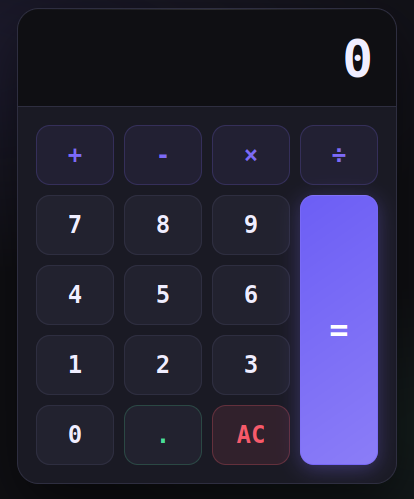

# TR
# Hesap Makinesi
Karanlık temalı, animasyonlu, dört işlem ve ondalık sayı desteği sunan tarayıcı tabanlı hesap makinesi. Saf HTML, CSS ve Vanilla JavaScript ile geliştirilmiştir.

## Canlı Önizleme

[Proje önizleme.](https://dursunkokturk.github.io/JavaScript-Project-4-Function-Calculator/)

## Özellikler

- Dört İşlem — Toplama, çıkarma, çarpma ve bölme
- Ondalık Sayı Desteği — . butonuyla ondalık giriş; aynı sayıya ikinci nokta eklenmez
- Zincirleme İşlem — Sonuç üzerinden yeni işlem yapmaya devam edilebilir
- 7 Ondalık Hane Duyarlılığı — toFixed(7) ile yuvarlama hataları minimize edilir
- AC Butonu — Ekranı sıfırlar, tüm durum değişkenleri başa döner
- Ripple & Hover Animasyonları — Buton tıklamalarında ::after pseudo-element ile efekt, hover'da translateY ile kalkma
- Olay Delegasyonu — Her butona ayrı listener yerine tek click listener tüm ızgarayı yönetir
- clamp() ile Akışkan Yazı Boyutu — Ekran genişliğine göre otomatik ölçeklenen font

🎛️ Buton Düzeni

|   |   |    |   |
| --|---| ---|---|
| + | - | x  | ÷ |
| 7 | 8 | 9  |   |
| 4 | 5 | 6  | = |
| 1 | 2 | 3  |   |
| 0 | . | AC |   |

= butonu CSS Grid ile sağ sütunda 4 satır boyunca uzanır (grid-area: 2 / 4 / 6 / 5).

## Durum Değişkenleri

| Değişken              | Açıklama                          |
| ----------------------|-----------------------------------|
| displayValue          | Ekranda görünen değer             |
| firstValue            | İlk girilen sayı                  |
| operator              | Seçilen işlem operatörü           |
| waitingForSecondValue | İkinci sayı girişi bekleniyor mu? |

## Teknolojiler

| Teknoloji    | Açıklama                                           |
| -------------|----------------------------------------------------|
| HTML5        | Semantik sayfa yapısı                              |
| CSS3         | CSS değişkenleri, Grid, clamp(), @media sorguları  |
| JavaScript   | Hesap mantığı, DOM manipülasyonu, olay delegasyonu |
| Google Fonts | DM Sans (arayüz), Space Mono (ekran ve butonlar)   |

## Proje Yapısı
calculator/  
├── index.html  
└── assets/  
    ├── css/  
    │   └── style.css  
    └── js/  
        └── calculator.js  

## Kurulum
Proje herhangi bir bağımlılık gerektirmez.
bash# Repoyu klonlayın
git clone https://github.com/kullanici-adi/calculator.git

### Proje klasörüne girin
cd calculator

### index.html dosyasını tarayıcıda açın
open index.html

#### Not: 
calculator.js dosyası defer ile yüklenir; DOM hazır olmadan önce çalışmaz.

## Tasarım Detayları

- Tema: Tam karanlık (dark-only)
- Renk Paleti (CSS değişkenleri):

    - --bg: #0f0f13 — Sayfa arka planı
    - --surface: #1a1a24 — Hesap makinesi yüzeyi
    - --accent: #7c6af7 — Mor vurgu (operatör butonları ve =)
    - --green: #4ade98 — Yeşil (ondalık nokta butonu)
    - --red: #f75a6a — Kırmızı (AC butonu)
    - --text-pri: #f0eeff — Birincil metin

- Fontlar: DM Sans (arayüz) · Space Mono (ekran ve tuş takımı)
- = Butonu: linear-gradient ile mor degrade, glow box-shadow ve grid'de tam sütun yüksekliği
- Arka Plan: İki radial gradient ile mor ve yeşil ışıma efekti
- Üst Işıma: .calculator::before ile ince yatay gradient çizgi

# EN
# Calculator
A dark-themed, animated browser-based calculator with four operations and decimal number support. Built with pure HTML, CSS, and  JavaScript.

## Live Preview
[Project Preview](https://dursunkokturk.github.io/JavaScript-Project-4-Function-Calculator/)

## Features

- Four Operations — Addition, subtraction, multiplication, and division
- Decimal Support — Decimal input via the . button; a second decimal point cannot be added to the same number
- Chained Operations — Continue calculating from the current result
- 7 Decimal Places Precision — Rounding errors minimized with toFixed(7)
- AC Button — Resets the display and returns all state variables to their initial values
- Ripple & Hover Animations — Click effect via ::after pseudo-element, lift on hover with translateY
- Event Delegation — A single click listener manages the entire grid instead of separate listeners per button
- Fluid Font Size with clamp() — Font automatically scales with screen width

🎛️ Button Layout
|   |   |    |   |
| --|---| ---|---|
| + | - | x  | ÷ |
| 7 | 8 | 9  |   |
| 4 | 5 | 6  | = |
| 1 | 2 | 3  |   |
| 0 | . | AC |   |

The = button spans 4 rows in the right column via CSS Grid (grid-area: 2 / 4 / 6 / 5).

## State Variables

| Variable              | Description                                    |
| ----------------------|------------------------------------------------|
| displayValue          | The value currently shown on the display       |
| firstValue            | İlk girilen sayı                               |
| operator              | The selected operation operator                |
| waitingForSecondValue | Is the calculator waiting for a second number? |

## Technologies

| Technology   | Description                                           |
| -------------|-------------------------------------------------------|
| HTML5        | Semantic page structure                               |
| CSS3         | CSS variables, Grid, clamp(), @media queries          |
| JavaScript   | Calculation logic, DOM manipulation, event delegation |
| Google Fonts | DM Sans (interface), Space Mono (display and buttons) |

## Project Structure
calculator/  
├── index.html  
└── assets/  
    ├── css/  
    │   └── style.css  
    └── js/  
        └── calculator.js  

## Installation
The project requires no dependencies.
bash# Clone the repo
git clone https://github.com/username/calculator.git

### Navigate to the project folder
cd calculator

### Open index.html in the browser
open index.html

#### Note: 
calculator.js is loaded with defer and will not run before the DOM is ready.

## Design Details
- Theme: Dark only
- Color Palette (CSS variables):

    - --bg: #0f0f13 — Page background
    - --surface: #1a1a24 — Calculator surface
    - --accent: #7c6af7 — Purple accent (operator buttons and =)
    - --green: #4ade98 — Green (decimal point button)
    - --red: #f75a6a — Red (AC button)
    - --text-pri: #f0eeff — Primary text

- Fonts: DM Sans (interface) · Space Mono (display and keypad)
- = Button: Purple gradient with linear-gradient, glow box-shadow, and full column height in the grid
- Background: Purple and green glow effect with two radial gradients
- Top Glow: Thin horizontal gradient line via .calculator::before
